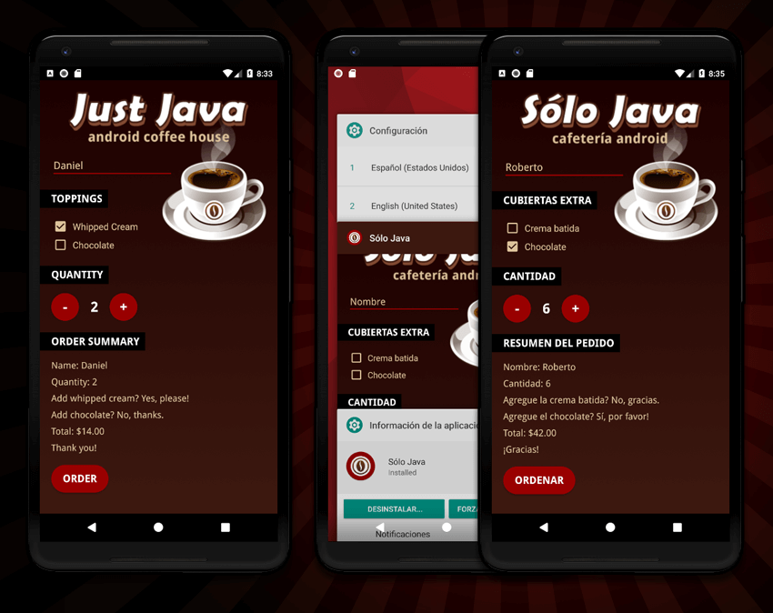

# Just Java

**Created for the *Grow with Google Challenge Scholarship:* Android Basics Course**

Used **API 23: Android 6.0 (Marshmallow)**

## Screenshots From the App:
This app is restricted in the code to display in portrait mode only.

## Features additional items not in the course
1. Custom icon
2. Logo automatically updates to Spanish version when the language is switched to Spanish.
3. "true" and "false" boolean changed to "Yes, please!" etc and in both languages.
4. Custom fonts
5. Gradient background is a shape gradient xml file
6. Custom button styles
